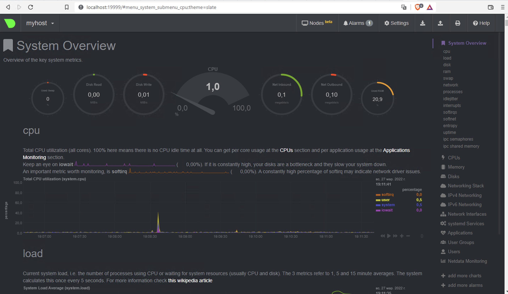

1.  На лекции мы познакомились с [node_exporter](https://github.com/prometheus/node_exporter/releases). В демонстрации его исполняемый файл запускался в background. Этого достаточно для демо, но не для настоящей production-системы, где процессы должны находиться под внешним управлением. Используя знания из лекции по systemd, создайте самостоятельно простой [unit-файл](https://www.freedesktop.org/software/systemd/man/systemd.service.html) для node_exporter:
    ```
    -   поместите его в автозагрузку,
    -   предусмотрите возможность добавления опций к запускаемому процессу через внешний файл (посмотрите, например, на `systemctl cat cron`),
    -   удостоверьтесь, что с помощью systemctl процесс корректно стартует, завершается, а после перезагрузки автоматически поднимается.

```
			Ответ:
			
			vagrant@myhost:~$ sudo vim /etc/systemd/system/node_exporter.service
						
			[Unit]
			Description=Node Exporter
			[Service]
			EnvironmentFile=-/etc/default/node_exporter
			ExecStart=/usr/sbin/node_exporter $OPTIONS
			[Install]
			WantedBy=multi-user.target
			
			vagrant@myhost:~$ sudo systemctl daemon-reload
			vagrant@myhost:~$ sudo systemctl enable node_exporter
			vagrant@myhost:~$ systemctl restart  node_exporter.service
			vagrant@myhost:~$ systemctl status node_exporter
● node_exporter.service - Node Exporter
     Loaded: loaded (/etc/systemd/system/node_exporter.service; enabled; vendor preset: enabled)
     Active: active (running) since Sun 2022-03-27 14:28:09 UTC; 13s ago
   Main PID: 1141 (node_exporter)
      Tasks: 5 (limit: 1071)
     Memory: 2.6M
     CGroup: /system.slice/node_exporter.service
             └─1141 /usr/sbin/node_exporter

Mar 27 14:28:09 myhost node_exporter[1141]: ts=2022-03-27T14:28:09.677Z caller=node_exporter.go:115 level=info collector=thermal_zone
Mar 27 14:28:09 myhost node_exporter[1141]: ts=2022-03-27T14:28:09.677Z caller=node_exporter.go:115 level=info collector=time
Mar 27 14:28:09 myhost node_exporter[1141]: ts=2022-03-27T14:28:09.677Z caller=node_exporter.go:115 level=info collector=timex
Mar 27 14:28:09 myhost node_exporter[1141]: ts=2022-03-27T14:28:09.677Z caller=node_exporter.go:115 level=info collector=udp_queues
Mar 27 14:28:09 myhost node_exporter[1141]: ts=2022-03-27T14:28:09.677Z caller=node_exporter.go:115 level=info collector=uname
Mar 27 14:28:09 myhost node_exporter[1141]: ts=2022-03-27T14:28:09.678Z caller=node_exporter.go:115 level=info collector=vmstat
Mar 27 14:28:09 myhost node_exporter[1141]: ts=2022-03-27T14:28:09.680Z caller=node_exporter.go:115 level=info collector=xfs
Mar 27 14:28:09 myhost node_exporter[1141]: ts=2022-03-27T14:28:09.681Z caller=node_exporter.go:115 level=info collector=zfs
Mar 27 14:28:09 myhost node_exporter[1141]: ts=2022-03-27T14:28:09.681Z caller=node_exporter.go:199 level=info msg="Listening on" address=:9100
Mar 27 14:28:09 myhost node_exporter[1141]: ts=2022-03-27T14:28:09.681Z   	caller=tls_config.go:195 level=info msg="TLS is disabled." http2=false
									
```
1. Ознакомьтесь с опциями node_exporter и выводом `/metrics` по-умолчанию. Приведите несколько опций, которые вы бы выбрали для базового мониторинга хоста по CPU, памяти, диску и сети.
    ответ:
```
		CPU
		node_cpu_seconds_total{cpu="0",mode="idle"} 
		node_cpu_seconds_total{cpu="0",mode="system"} 
		node_cpu_seconds_total{cpu="0",mode="user"} 		process_cpu_seconds_total 0.44
		Memory
		node_memory_MemFree_bytes 
		node_memory_MemAvailable_bytes 
		Disk
		node_disk_io_time_seconds_total{device="sda"}
		node_disk_read_bytes_total{device="sda"}
		Network
		node_network_receive_bytes_total{device="eth1"}
		node_network_transmit_bytes_total{device="eth1"}
```
1.  Установите в свою виртуальную машину [Netdata](https://github.com/netdata/netdata). Воспользуйтесь [готовыми пакетами](https://packagecloud.io/netdata/netdata/install) для установки (`sudo apt install -y netdata`). После успешной установки:
    ```
    -   в конфигурационном файле `/etc/netdata/netdata.conf` в секции [web] замените значение с localhost на `bind to = 0.0.0.0`,
    -   добавьте в Vagrantfile проброс порта Netdata на свой локальный компьютер и сделайте `vagrant reload`:
    
    config.vm.network "forwarded_port", guest: 19999, host: 19999
    
    После успешной перезагрузки в браузере _на своем ПК_ (не в виртуальной машине) вы должны суметь зайти на `localhost:19999`. Ознакомьтесь с метриками, которые по умолчанию собираются Netdata и с комментариями, которые даны к этим метрикам.
	
   

4.  Можно ли по выводу `dmesg` понять, осознает ли ОС, что загружена не на настоящем оборудовании, а на системе виртуализации?
```
		Ответ: да можно
		 
		 vagrant@myhost:~$ dmesg | grep virt
		[    0.003511] CPU MTRRs all blank - virtualized system.
		[    0.128341] Booting paravirtualized kernel on KVM
		[    3.226232] systemd[1]: Detected virtualization oracle.
```    
5.  Как настроен sysctl `fs.nr_open` на системе по-умолчанию? Узнайте, что означает этот параметр. Какой другой существующий лимит не позволит достичь такого числа (`ulimit --help`)?

Ответ:
```
Значение по умолчанию sysctl `fs.nr_open` 
vagrant@vagrant:~$ sudo sysctl -a | grep 'fs.nr_open'
fs.nr_open = 1048576 (Значение по умолчанию, отвечает за максимально возможное количество открытых файловых дескрипторов системы на пользователя)
vagrant@vagrant:~$ ulimit --help
другой существующий лимит не позволяющий достичь такого числа
vagrant@vagrant:~$ vagrant@vagrant:~$ ulimit -Hn (жестко заданное число открытых файловых дескрипторов)
1048576


```

    
6.  Запустите любой долгоживущий процесс (не `ls`, который отработает мгновенно, а, например, `sleep 1h`) в отдельном неймспейсе процессов; покажите, что ваш процесс работает под PID 1 через `nsenter`. Для простоты работайте в данном задании под root (`sudo -i`). Под обычным пользователем требуются дополнительные опции (`--map-root-user`) и т.д.
     Ответ: 
```
		vagrant@myhost:~$sudo unshare -f --pid  --mount-proc sleep 1h
	 	vagrant@myhost:~$ps aux | grep 'sleep 1h'
	 	root       15116  0.0  0.0   5476   580 pts/5    S    19:45   0:00 sleep 1h
	 	vagrant@myhost:~$ sudo nsenter --target  15116 --pid --mount
		root@myhost:/# ps aux
		USER         PID %CPU %MEM    VSZ   RSS TTY      STAT START   TIME COMMAND
		root           1  0.0  0.0   5476   580 pts/5    S+   19:45   0:00 sleep 1h
		root           2  0.1  0.4   7236  4036 pts/6    S    19:47   0:00 -bash
		root          13  0.0  0.3   8888  3308 pts/6    R+   19:48   0:00 ps aux
```
1.   Найдите информацию о том, что такое `:(){ :|:& };:`. Запустите эту команду в своей виртуальной машине Vagrant с Ubuntu 20.04 (**это важно, поведение в других ОС не проверялось**). Некоторое время все будет "плохо", после чего (минуты) – ОС должна стабилизироваться. Вызов `dmesg` расскажет, какой механизм помог автоматической стабилизации. Как настроен этот механизм по-умолчанию, и как изменить число процессов, которое можно создать в сессии?
	Ответ:
 ```
	`:(){ :|:& };:` Форк бомба-которая работает путем порождения все большего количества процессов, пока в конечном итоге все ресурсы системы не будут исчерпаны
	-   ':' – это имя функции
	-   ':|:' вызывает саму функцию и порождает другой процесс
	-   '&' переводит процесс в фоновый режим, чтобы его нельзя было легко убить
	-   ';' отмечает конец функции
	-   ':' снова вызывает функцию
	
	vagrant@myhost:~$ :(){ :|:& };:
	-bash: fork: retry: Resource temporarily unavailable
	-bash: fork: retry: Resource temporarily unavailable
	-bash: fork: Resource temporarily unavailable
	
	
[ 2373.405826] cgroup: fork rejected by pids controller in /user.slice/user-1000.slice/session-5.scope
vagrant@vagrant:~$ ulimit -Ha
max user processes              (-u) 3571
изменить число процессов можно следующим способом:
vagrant@vagrant:~$ ulimit -u 1000

```