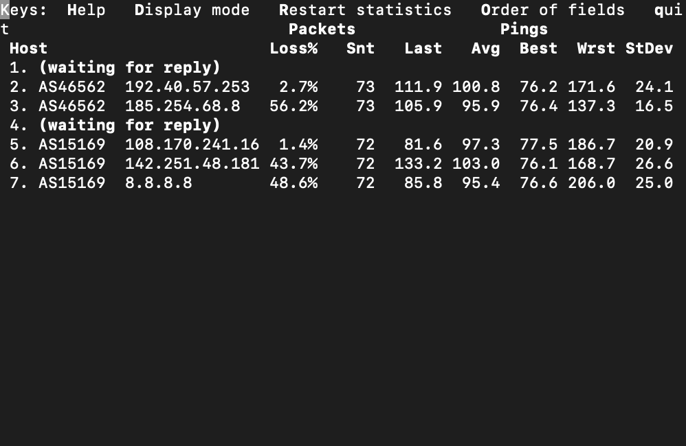

# Домашнее задание к занятию "3.6. Компьютерные сети, лекция 1"

1.  Работа c HTTP через телнет.

-   Подключитесь утилитой телнет к сайту stackoverflow.com `telnet stackoverflow.com 80`
-   отправьте HTTP запрос

GET /questions HTTP/1.0
HOST: stackoverflow.com
[press enter]
[press enter]

- В ответе укажите полученный HTTP код, что он означает?

Ответ:
```
- vagrant@vagrant:~$ telnet stackoverflow.com 80
Trying 151.101.129.69...
Connected to stackoverflow.com.
Escape character is '^]'.
GET /questions HTTP/1.0
HOST: stackoverflow.com

HTTP/1.1 301 Moved Permanently (запрошенный ресурс перемещен в новое местоположение, идет редирект на https версию)
cache-control: no-cache, no-store, must-revalidate
location: https://stackoverflow.com/questions
x-request-guid: 534dbb03-df9f-40f0-af21-33e22e6ff8f6
feature-policy: microphone 'none'; speaker 'none'
content-security-policy: upgrade-insecure-requests; frame-ancestors 'self' https://stackexchange.com
Accept-Ranges: bytes
Date: Thu, 21 Apr 2022 14:37:25 GMT
Via: 1.1 varnish
Connection: close
X-Served-By: cache-hhn4081-HHN
X-Cache: MISS
X-Cache-Hits: 0
X-Timer: S1650551846.523450,VS0,VE85
Vary: Fastly-SSL
X-DNS-Prefetch-Control: off
Set-Cookie: prov=0b90fb63-0020-c977-9fd8-83e9a6833aa9; domain=.stackoverflow.com; expires=Fri, 01-Jan-2055 00:00:00 GMT; path=/; HttpOnly

Connection closed by foreign host.


```


2.  Повторите задание 1 в браузере, используя консоль разработчика F12.

- откройте вкладку `Network`
- отправьте запрос [http://stackoverflow.com](http://stackoverflow.com/)
- найдите первый ответ HTTP сервера, откройте вкладку `Headers`
- укажите в ответе полученный HTTP код.
- проверьте время загрузки страницы, какой запрос обрабатывался дольше всего?
- приложите скриншот консоли браузера в ответ.

Ответ:


3.  Какой IP адрес у вас в интернете?


4.  Какому провайдеру принадлежит ваш IP адрес? Какой автономной системе AS? Воспользуйтесь утилитой `whois`
```
vagrant@vagrant:~$ whois 190.2.138.17
owner:       WorldStream B.V.


vagrant@vagrant:~$ whois -h whois.radb.net 190.2.138.17
route:      190.2.128.0/20
descr:      WorldStream
origin:     AS49981 (автономная система)
```


5.  Через какие сети проходит пакет, отправленный с вашего компьютера на адрес 8.8.8.8? Через какие AS? Воспользуйтесь утилитой `traceroute`
```

**➜** **~** traceroute -a 8.8.8.8 

traceroute to 8.8.8.8 (8.8.8.8), 64 hops max, 52 byte packets

 1 * * *

 2 [AS2711] unn-169-150-196-125.datapacket.com (169.150.196.125) 85.482 ms 76.385 ms
 [AS2711] unn-169-150-196-124.datapacket.com (169.150.196.124) 87.173 ms
 3 [AS60068] vl201.ams-dc1-core-1.cdn77.com (138.199.0.108) 75.972 ms
 [AS60068] vl202.ams-dc1-core-2.cdn77.com (138.199.0.112) 76.811 ms
 [AS60068] vl203.ams-dc1-core-1.cdn77.com (138.199.0.110) 75.342 ms
 4 [AS60068] vl250.ams-dc1-core-1.cdn77.com (138.199.0.138) 78.040 ms
 [AS6453] 80.231.85.9 (80.231.85.9) 75.553 ms
 [AS60068] vl250.ams-dc1-core-1.cdn77.com (138.199.0.138) 76.353 ms
 5 * * [AS6453] 80.231.85.9 (80.231.85.9) 77.703 ms
 6 [AS6453] if-ae-41-2.tcore1.av2-amsterdam.as6453.net (195.219.194.26) 76.132 ms 81.605 ms 77.985 ms
 7 [AS15169] 209.85.172.236 (209.85.172.236) 75.871 ms
 [AS15169] 108.170.241.161 (108.170.241.161) 77.161 ms
 [AS15169] 108.170.241.225 (108.170.241.225) 77.192 ms
 8 [AS15169] 142.250.224.131 (142.250.224.131) 77.045 ms
 [AS15169] 142.251.66.241 (142.251.66.241) 76.065 ms
 [AS15169] 142.251.48.177 (142.251.48.177) 115.781 ms
 9 [AS15169] 142.251.48.177 (142.251.48.177) 76.749 ms
 [AS15169] 142.251.48.179 (142.251.48.179) 78.914 ms
 [AS15169] dns.google (8.8.8.8) 76.270 ms
```
6.  Повторите задание 5 в утилите `mtr`. На каком участке наибольшая задержка - delay?
      

**➜** **~** sudo mtr  -zn 8.8.8.8



7.  Какие DNS сервера отвечают за доменное имя dns.google? Какие A записи? воспользуйтесь утилитой `dig`
```
vagrant@vagrant:~$ dig dns.google

;; ANSWER SECTION:
dns.google.             305     IN      A       8.8.8.8
dns.google.             305     IN      A       8.8.4.4

```
13.  Проверьте PTR записи для IP адресов из задания 7. Какое доменное имя привязано к IP? воспользуйтесь утилитой `dig`

```
vagrant@vagrant:~$ dig -x 8.8.8.8
;; ANSWER SECTION:
8.8.8.8.in-addr.arpa.   10838   IN      PTR     dns.google.

vagrant@vagrant:~$ dig -x 8.8.4.4
;; ANSWER SECTION:
4.4.8.8.in-addr.arpa.   8725    IN      PTR     dns.google.
