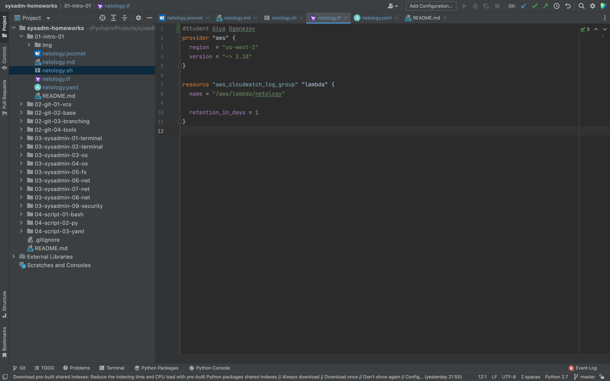
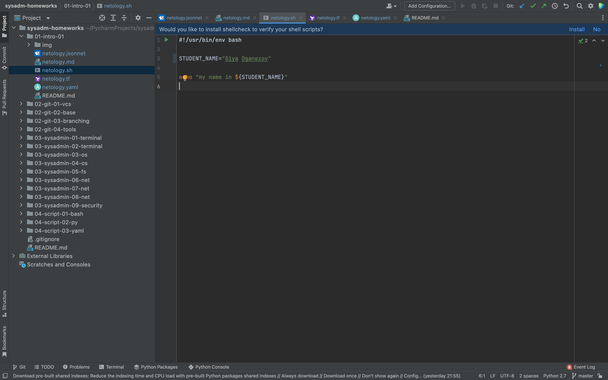
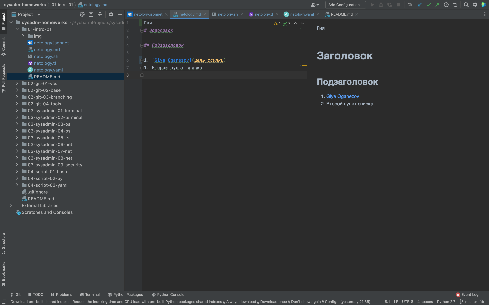
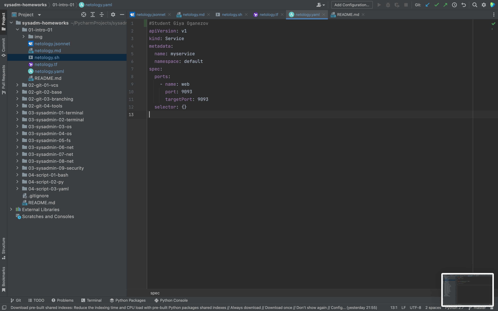
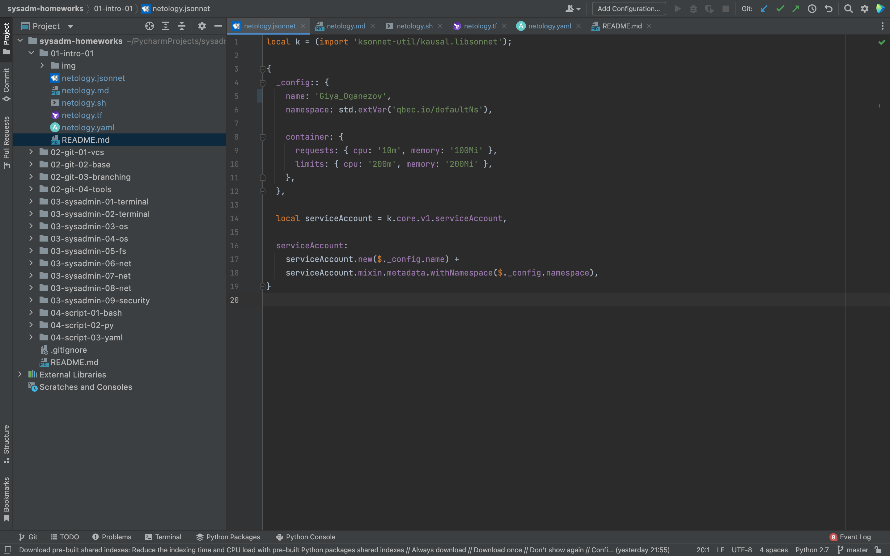

# Домашнее задание к занятию «1.1. Введение в DevOps»

## Задание №1 - Подготовка рабочей среды

1. Установил Py Charm Community Edition. 
1. Установил плагины:
    - Terraform,
    - MarkDown,
    - Yaml/Ansible Support,
    - Jsonnet.

1. Проверил работу подсветки синтаксиса
    - Terraform: 
    - Bash: 
    - Markdown: 
    - Yaml: 
    - Jsonnet: 

азин достаточно успешно развивался, и вот пришло время налаживать процессы: у вас стало больше конечных клиентов, менеджеров и разработчиков.Сейчас от клиентов вам приходят задачи, связанные с разработкой нового функционала. Задач много, и все они требуют выкладки на тестовые среды, одобрения тестировщика, проверки менеджером перед показом клиенту. В случае необходимости, вам будет необходим откат изменений.
1. Задача поступает от клиентов
2. Менеджер ставит задачи DevOps:
   - создания среды для разработчиков;
   - создание среды для тестировщиков;
3. Менеджер ставит задачи на реализацию кода и тестов
4. DevOps создает среды
5. Разработчики пишут код и тесты
6. Тестировщики проверяют код (в случае неуспешной проверки код возвращается на доработку)
8. Менеджер проводит презентацию
9. Релиз (в случае неуспеха-откат до исходного состояния)
