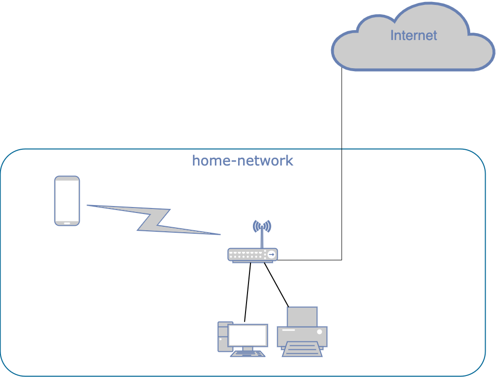

# Домашнее задание к занятию "3.8. Компьютерные сети, лекция 3"

1. Подключитесь к публичному маршрутизатору в интернет. Найдите маршрут к вашему публичному IP
```
telnet route-views.routeviews.org
Username: rviews
show ip route x.x.x.x/32
show bgp x.x.x.x/32
```

Ответ:
```
vagrant@vagrant:~$ telnet route-views.routeviews.org
route-views>show ip route 49.12.190.93   
Routing entry for 49.12.0.0/16
  Known via "bgp 6447", distance 20, metric 0
  Tag 6939, type external
  Last update from 64.71.137.241 02:57:21 ago
  Routing Descriptor Blocks:
  * 64.71.137.241, from 64.71.137.241, 02:57:21 ago
      Route metric is 0, traffic share count is 1
      AS Hops 2
      Route tag 6939
      MPLS label: none
route-views>show bgp 49.12.190.93     
BGP routing table entry for 49.12.0.0/16, version 2209263011
Paths: (24 available, best #19, table default)
  Not advertised to any peer
  Refresh Epoch 1
  701 3320 3320 3320 24940 24940
    137.39.3.55 from 137.39.3.55 (137.39.3.55)
      Origin IGP, localpref 100, valid, external
      path 7FE0E4E4A228 RPKI State valid
      rx pathid: 0, tx pathid: 0
  Refresh Epoch 1
  53767 174 24940 24940 24940 24940 24940 24940 24940 24940 24940 24940
    162.251.163.2 from 162.251.163.2 (162.251.162.3)
      Origin IGP, localpref 100, valid, external
      Community: 174:21101 174:22005 53767:5000
      path 7FE0421ED0D0 RPKI State valid
      rx pathid: 0, tx pathid: 0
  Refresh Epoch 1
  3333 24940 24940
    193.0.0.56 from 193.0.0.56 (193.0.0.56)
      Origin IGP, localpref 100, valid, external
      Community: 24940:24940
      path 7FE11588B968 RPKI State valid
      rx pathid: 0, tx pathid: 0
  Refresh Epoch 1
  8283 24940 24940
    94.142.247.3 from 94.142.247.3 (94.142.247.3)
      Origin IGP, metric 0, localpref 100, valid, external
      Community: 8283:1 8283:101 8283:102 24940:24940
      unknown transitive attribute: flag 0xE0 type 0x20 length 0x24
        value 0000 205B 0000 0000 0000 0001 0000 205B
```

2. Создайте dummy0 интерфейс в Ubuntu. Добавьте несколько статических маршрутов. Проверьте таблицу маршрутизации.
Ответ:
```

root@ubuntu:/home/giya# sudo ip link add dummy0 type dummy
root@ubuntu:~# sudo touch /etc/systemd/network/dummy0.netdev
root@ubuntu:~# sudo touch /etc/systemd/network/dummy0.network
root@ubuntu:~# cat  /etc/systemd/network/dummy0.network
[Match]
Name=dummy0
[Network]
Address=192.168.0.100
Mask=255.255.255.0
root@ubuntu:~# cat  /etc/systemd/network/dummy0.netdev
[NetDev]
Name=dummy0
Kind=dummy
root@ubuntu:~# ip a
1: lo: <LOOPBACK,UP,LOWER_UP> mtu 65536 qdisc noqueue state UNKNOWN group default qlen 1000
    link/loopback 00:00:00:00:00:00 brd 00:00:00:00:00:00
    inet 127.0.0.1/8 scope host lo
       valid_lft forever preferred_lft forever
    inet6 ::1/128 scope host
       valid_lft forever preferred_lft forever
2: eth0: <BROADCAST,MULTICAST,UP,LOWER_UP> mtu 1500 qdisc mq state UP group default qlen 1000
    link/ether d0:0d:1a:a0:6f:6e brd ff:ff:ff:ff:ff:ff
    inet 10.129.0.13/24 brd 10.129.0.255 scope global eth0
       valid_lft forever preferred_lft forever
    inet6 fe80::d20d:1aff:fea0:6f6e/64 scope link
       valid_lft forever preferred_lft forever
4: dummy0: <BROADCAST,NOARP,UP,LOWER_UP> mtu 1500 qdisc noqueue state UNKNOWN group default qlen 1000
    link/ether 92:a7:d9:e1:98:a2 brd ff:ff:ff:ff:ff:ff
    inet 192.168.0.100/24 brd 192.168.0.255 scope global dummy0
       valid_lft forever preferred_lft forever
    inet6 fe80::90a7:d9ff:fee1:98a2/64 scope link
       valid_lft forever preferred_lft forever

```
3. Проверьте открытые TCP порты в Ubuntu, какие протоколы и приложения используют эти порты? Приведите несколько примеров.
Ответ:
```
State          Recv-Q          Send-Q                    Local Address:Port                       Peer Address:Port           Process
ESTAB          0               36                          10.129.0.13:ssh                      85.162.159.225:55058
```
4. Проверьте используемые UDP сокеты в Ubuntu, какие протоколы и приложения используют эти порты?
Ответ:
```
root@ubuntu:~# ss -ua
State           Recv-Q          Send-Q                      Local Address:Port                     Peer Address:Port          Process
UNCONN          0               0                           127.0.0.53%lo:domain                        0.0.0.0:*
UNCONN          0               0                        10.129.0.13%eth0:bootpc                        0.0.0.0:*
```
5. Используя diagrams.net, создайте L3 диаграмму вашей домашней сети или любой другой сети, с которой вы работали. 
Ответ:



 ---
## Задание для самостоятельной отработки (необязательно к выполнению)

6*. Установите Nginx, настройте в режиме балансировщика TCP или UDP.

7*. Установите bird2, настройте динамический протокол маршрутизации RIP.

8*. Установите Netbox, создайте несколько IP префиксов, используя curl проверьте работу API.

 ---
